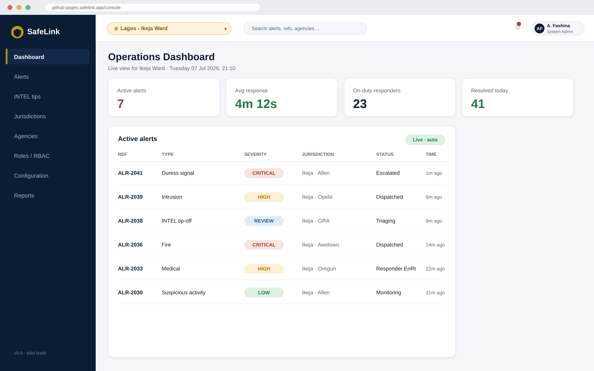
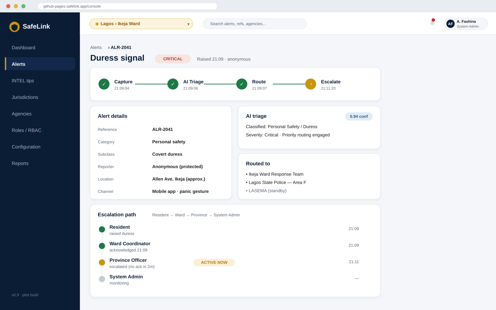
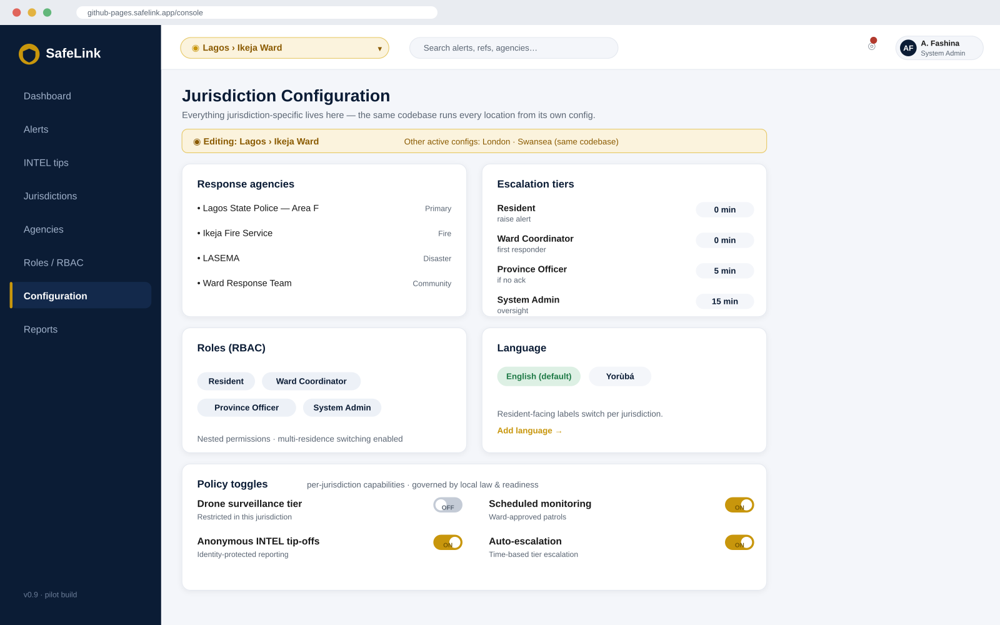

# SafeLink (Abẹ́-Abọ̀)

**A config-driven community-security and emergency-alert platform — one codebase, many jurisdictions.**

## Overview

SafeLink provides residents with a platform to raise alarm and share intelligence within the household, immediate community, and routes each alert to the community, Estate guards and respective local security and emergency agencies. Safelink defining attribute is that **all features that are jurisdiction-specific remains in a single configuration source** — security and emergency response agencies, escalation levels/tiers, roles/functions, language, and policy toggles, therefore whenever there is deployment to another city, it is only a matter of configuration exercise, and not a new build.


SafeLink is built for community-safety contexts in **Nigeria** with similar applicability to the **UK**, and designed to align with a very new State Policing reform act of June 2026 (Nigeria State Police Bill, 2026].


## Key features

* **Config-driven multi-jurisdiction core** — the same platform applicable to different cities from different configuration.
* **AI triage** - alerts systems routed automatically, which is classified by levels of severity.
* **Covert duress alert -** a silent, discreet distress signalling for high-risk scenarios.
* **Anonymous INTEL tip-offs** — Protection of identity of intel reporters, in a low-trust environments.
* **Tiered RBAC** — Resident => Community =>Ward level =>LGA/Province => and System Admin, with multi-layers switching.
* **Policy Switches/toggles** — per-jurisdiction capabilities (e.g. drone level/tier, scheduled monitoring/surveillance).

## Architecture

Jurisdiction logic lives in configuration and data, not in code. See [`docs/architecture.md`](docs/architecture.md) for the full diagram and the alert lifecycle (capture → AI triage → route → escalate).

```
Single configuration source
        │
   ┌────┼────┐
 Lagos London Swansea      ← same codebase, own config
```

## Tech stack

* **Frontend:** \[Next.js / React]
* **Backend:** \[Node.js / TypeScript]
* **Data:** \[Supabase / PostgreSQL]
* **Integrations:** \[NIMC/NIN verification, SMS/USSD, mapping]

## Screenshots

<! See screenshots below-->




## Getting started

```bash
https://github.com/Adefash001/safelink.git
cd safelink
\[npm install]
\[npm run dev]
```

Configuration for a jurisdiction lives in \[`config/\[jurisdiction].json`].

## Roadmap

* \[ ] \[Lagos pilot deployment]
* \[ ] \[UK jurisdiction configuration]
* \[ ] \[Drone-tier policy module]

## Author

**Adeniyi Fashina** — Product-led Technologist and Founder, VP-Afric Business Solutions Ltd.
\[portfolio link] · \[LinkedIn]

## License

Released under the MIT License — see [`LICENSE`](LICENSE).

